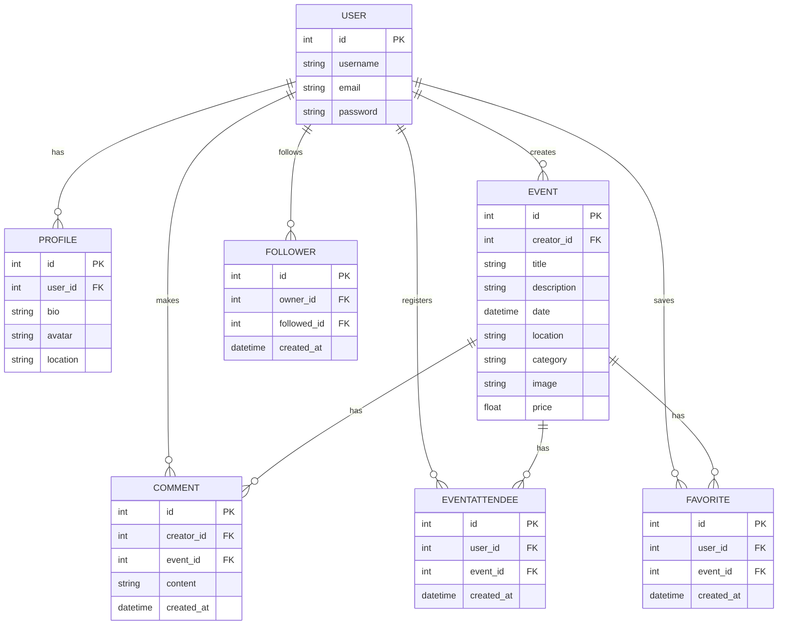

# Eventify API Backend

## Table of Contents

- [Overview](#overview)
- [Features](#features)
- [Database Schema](#database-schema)
- [Models](#models)
- [API Endpoints](#api-endpoints)
- [Technologies Used](#technologies-used)
- [Testing](#testing)
- [Deployment](#deployment)
- [Local Development](#local-development)
- [Credits and Acknowledgements](#credits-and-acknowledgements)

## Overview

Eventify API is a RESTful API built with Django REST Framework that serves as the backend for the Eventify event management platform. The API provides endpoints for user authentication, event management, comments, likes, favorites, and follows functionality.

## Features

- User authentication and registration
- Complete CRUD functionality for events
- Search and filter capabilities
- Custom models for users, events, comments, favorites, and follows
- Secure API with proper permissions
- User profiles with customizable information

## Database Schema

The API consists of multiple custom models that store and manage data. Below is a simple Entity Relationship Diagram (ERD) showing the relationships between models:

### Entity Relationship Diagram



### User Model
| Field | Type | Description |
|-------|------|-------------|
| email | CharField | User's email address |
| username | CharField | User's chosen username |
| password | CharField | Encrypted password |

### Profile Model
| Field | Type | Description |
|-------|------|-------------|
| user | OneToOneField | Link to User model |
| bio | TextField | User's biography |
| avatar | ImageField | Profile picture |
| location | CharField | User's location |

### Event Model
| Field | Type | Description |
|-------|------|-------------|
| title | CharField | Event title |
| description | TextField | Event description |
| date | DateTimeField | Event date and time |
| location | CharField | Event location |
| category | CharField | Event category |
| image | ImageField | Event cover image |
| creator | ForeignKey | Link to User model |

## Models

### Event Model

The Event model stores information about events:
- Title
- Description
- Date
- Location
- Category
- Cover image
- Price

### EventAttendee Model

The EventAttendee model tracks who is attending which events:
- Owner (User)
- Event
- Registration timestamp

This creates a many-to-many relationship between users and events, allowing users to register for multiple events and events to have multiple attendees.


## API Endpoints

The API provides the following endpoints:

- `/api/auth/` - Authentication endpoints
- `/api/events/` - Event management endpoints
- `/api/profiles/` - User profile endpoints
- `/api/comments/` - Comment management endpoints
- `/api/favorites/` - Favorites management endpoints
- `/api/follows/` - User follow relationship endpoints

### Events

- `GET /api/events/` - List all events
- `POST /api/events/` - Create a new event (authenticated users only)
- `GET /api/events/:id/` - Get details for a specific event
- `PUT /api/events/:id/` - Update an event (owner only)
- `DELETE /api/events/:id/` - Delete an event (owner only)

### Event Attendance

- `GET /api/attendees/` - List events the current user is attending
- `POST /api/attendees/` - Register for an event (body should contain event ID)
- `GET /api/attendees/:id/` - Get details of a specific attendance record
- `DELETE /api/attendees/:id/` - Cancel registration for an event
- `GET /api/events/:event_id/attendees/` - List all attendees for a specific event (event owner or attendees only)


## Technologies Used

### Languages
- Python 3.9

### Frameworks and Libraries
- Django 4.2
- Django REST Framework
- PostgreSQL
- Token Authentication
- Cloudinary (for image storage)
- Pillow
- django-cors-headers

## Testing

Manual testing was conducted throughout the development process to ensure the API functions correctly and meets all requirements. Tests were performed for all CRUD operations across all models.

### Python Code Validation

All Python code in the application was validated using the PEP8 Python validator to ensure it follows Python's style guidelines. While the code is generally compliant with PEP8 standards, there are a few development artifacts like debug print statements that should be removed or replaced with proper logging before final production deployment. These minor issues do not affect functionality and are common during the development phase.

| File | Result | Notes |
|------|--------|-------|
| models.py | ⚠️ Pass with warnings | No major issues found |
| views.py | ⚠️ Pass with warnings | Contains debug print statements |
| serializers.py | ⚠️ Pass with warnings | Contains debug print statements |
| urls.py | ✅ Pass | No issues found |
| permissions.py | ✅ Pass | No issues found |
| settings.py | ✅ Pass | Some line length exceptions for configuration variables |

### Testing Process

1. Endpoint testing using Postman
2. Database integrity and validation testing
3. Authentication and permission testing
4. Error handling testing
5. Cloudinary image upload testing

### Cloudinary Integration

The application integrates with Cloudinary for image storage. During development, we encountered issues with image uploads to Cloudinary. We implemented the following approach to diagnose and fix the issues:

1. Added proper error handling in the Event model to gracefully handle Cloudinary upload failures
2. Correctly configured the CloudinaryField in models.py with appropriate transformations
3. Verified Cloudinary credentials and connection through diagnostic tests
4. Implemented validation for image uploads (size and file type)
5. Ensured the React frontend correctly handles multipart/form-data for image uploads

The integration now works seamlessly, allowing users to upload images for events which are stored in Cloudinary and served through their CDN.

Testing documentation with results:


## Deployment

The Eventify API is deployed on Heroku with a PostgreSQL database.

### Deployment Process

1. Create a new Heroku app
2. Set up PostgreSQL add-on
3. Configure environment variables
4. Connect GitHub repository for continuous deployment
5. Deploy the main branch

### Environment Variables

The following environment variables need to be set for deployment:

- `SECRET_KEY` - Django secret key
- `DEBUG` - Set to False for production
- `DATABASE_URL` - PostgreSQL database URL
- `ALLOWED_HOSTS` - Comma-separated list of allowed hosts
- `CLOUDINARY_CLOUD_NAME` - Cloudinary cloud name
- `CLOUDINARY_API_KEY` - Cloudinary API key
- `CLOUDINARY_API_SECRET` - Cloudinary API secret

## Local Development

To run the API locally:

1. Clone the repository:
```
git clone https://github.com/your-username/eventify-django.git
```

2. Create a virtual environment:
```
python -m venv venv
source venv/bin/activate  # On Windows: venv\Scripts\activate
```

3. Install dependencies:
```
pip install -r requirements.txt
```

4. Set up environment variables in a `.env` file

5. Run migrations:
```
python manage.py migrate
```

6. Start the server:
```
python manage.py runserver
```

## Credits and Acknowledgements

- Django REST Framework documentation
- Code Institute tutorials

## FrontEnd
This django Rest Framework application creates the main functionality API's. These are then consumed by the React Frontend application to create the apps main functionality. For more information about the frontend, please visit the backend repository.
https://github.com/Lochy2000/eventify-frontend/
