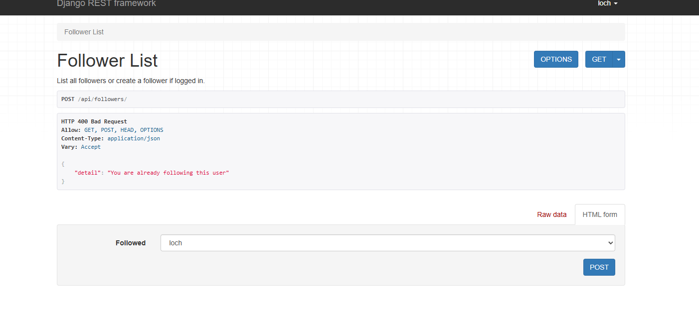
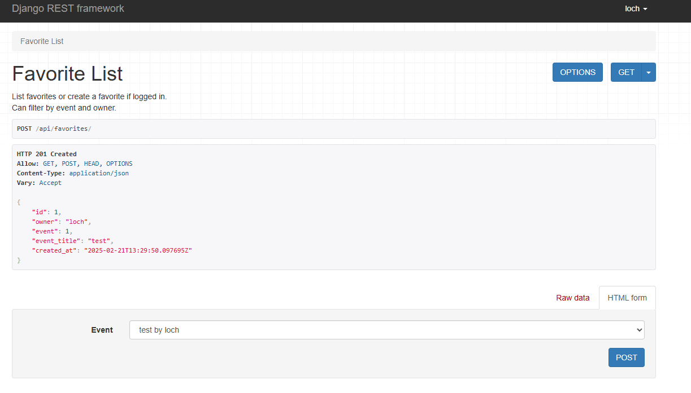
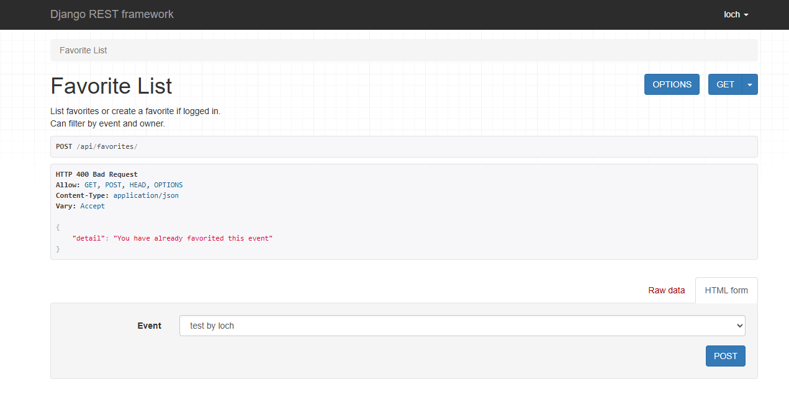

# Eventify API Backend

## Table of Contents

- [Overview](#overview)
- [Features](#features)
- [Database Schema](#database-schema)
- [API Endpoints](#api-endpoints)
- [Technologies Used](#technologies-used)
- [Testing](#testing)
- [Deployment](#deployment)
- [Local Development](#local-development)
- [Credits and Acknowledgements](#credits-and-acknowledgements)

## Overview

Eventify API is a RESTful API built with Django REST Framework that serves as the backend for the Eventify event management platform. The API provides endpoints for user authentication, event management, comments, likes, favorites, and follows functionality.

## Features

- User authentication and registration
- Complete CRUD functionality for events
- Search and filter capabilities
- Custom models for users, events, comments, favorites, and follows
- Secure API with proper permissions
- User profiles with customizable information

## Database Schema

The API consists of multiple custom models that store and manage data:

### User Model
| Field | Type | Description |
|-------|------|-------------|
| email | CharField | User's email address |
| username | CharField | User's chosen username |
| password | CharField | Encrypted password |

### Profile Model
| Field | Type | Description |
|-------|------|-------------|
| user | OneToOneField | Link to User model |
| bio | TextField | User's biography |
| avatar | ImageField | Profile picture |
| location | CharField | User's location |

### Event Model
| Field | Type | Description |
|-------|------|-------------|
| title | CharField | Event title |
| description | TextField | Event description |
| date | DateTimeField | Event date and time |
| location | CharField | Event location |
| category | CharField | Event category |
| image | ImageField | Event cover image |
| creator | ForeignKey | Link to User model |

## API Endpoints

The API provides the following endpoints:

- `/api/auth/` - Authentication endpoints
- `/api/events/` - Event management endpoints
- `/api/profiles/` - User profile endpoints
- `/api/comments/` - Comment management endpoints
- `/api/favorites/` - Favorites management endpoints
- `/api/follows/` - User follow relationship endpoints

## Technologies Used

### Languages
- Python 3.9

### Frameworks and Libraries
- Django 4.2
- Django REST Framework
- PostgreSQL
- JWT Authentication
- Pillow
- django-cors-headers

## Testing

Manual testing was conducted throughout the development process to ensure the API functions correctly and meets all requirements. Tests were performed for all CRUD operations across all models.

### Testing Process

1. Endpoint testing using Postman
2. Database integrity and validation testing
3. Authentication and permission testing
4. Error handling testing

Testing documentation with results:






## Deployment

The Eventify API is deployed on Heroku with a PostgreSQL database.

### Deployment Process

1. Create a new Heroku app
2. Set up PostgreSQL add-on
3. Configure environment variables
4. Connect GitHub repository for continuous deployment
5. Deploy the main branch

### Environment Variables

The following environment variables need to be set for deployment:

- `SECRET_KEY` - Django secret key
- `DEBUG` - Set to False for production
- `DATABASE_URL` - PostgreSQL database URL
- `ALLOWED_HOSTS` - Comma-separated list of allowed hosts

## Local Development

To run the API locally:

1. Clone the repository:
```
git clone https://github.com/your-username/eventify-django.git
```

2. Create a virtual environment:
```
python -m venv venv
source venv/bin/activate  # On Windows: venv\Scripts\activate
```

3. Install dependencies:
```
pip install -r requirements.txt
```

4. Set up environment variables in a `.env` file

5. Run migrations:
```
python manage.py migrate
```

6. Start the server:
```
python manage.py runserver
```

## Credits and Acknowledgements

- Django REST Framework documentation
- Code Institute tutorials
