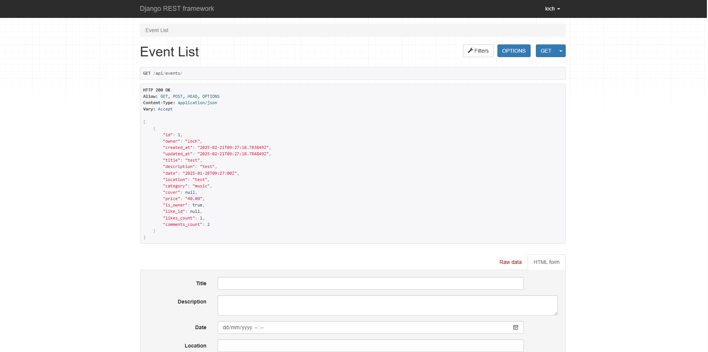
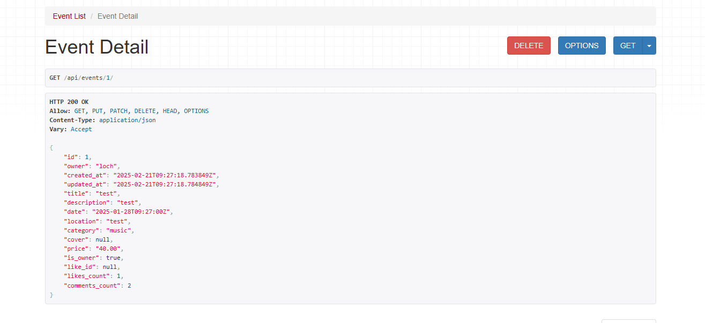
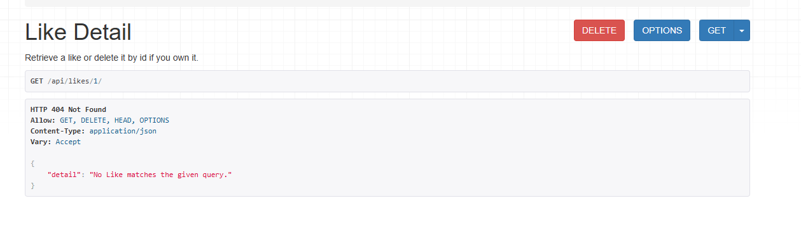
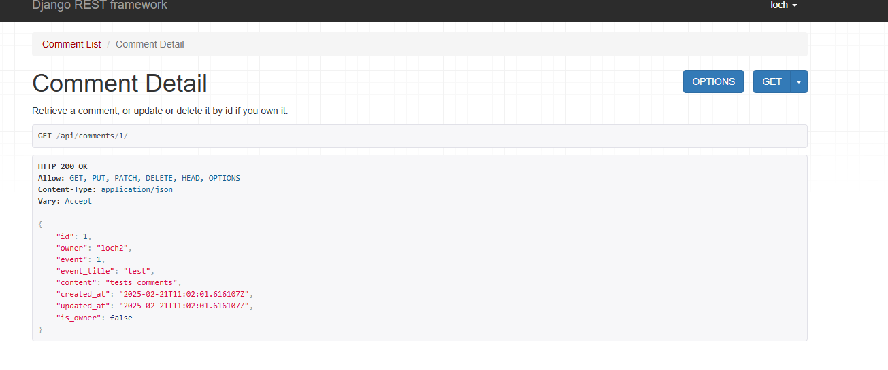
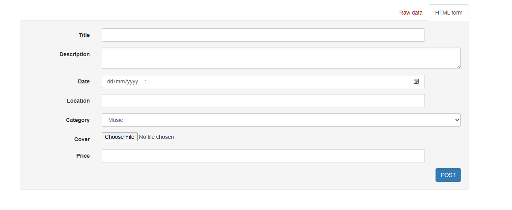
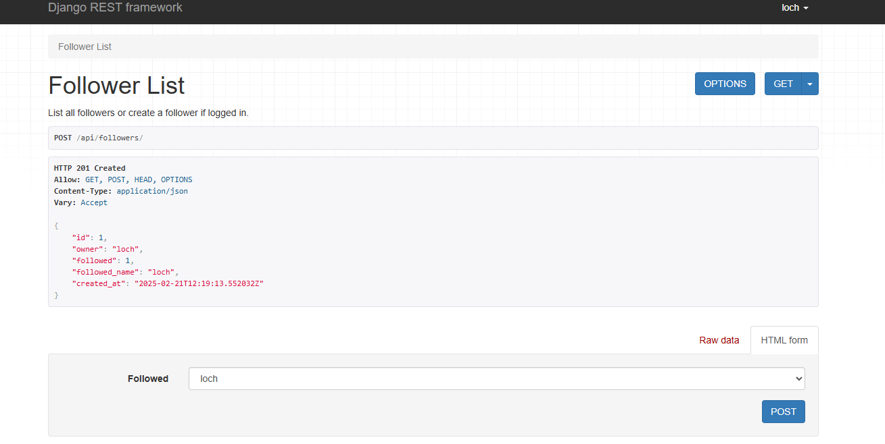
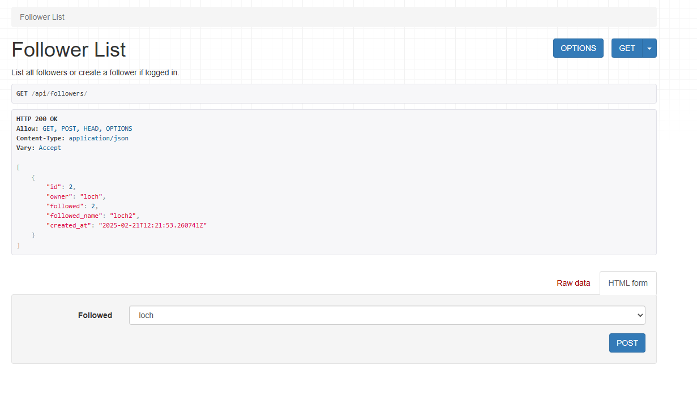

Eventify API Backend

Table of Contents

Overview
Features
Database Schema
API Endpoints
Technologies Used
Getting Started
API Documentation
Testing
Deployment
Contributing

Models
User Model
FieldTypeDescriptionemailCharFieldUser's email addressusernameCharFieldUser's chosen usernamepasswordCharFieldEncrypted password
Profile Model
FieldTypeDescriptionuserOneToOneFieldLink to User modelbioTextFieldUser's biographyavatarImageFieldProfile picturelocationCharFieldUser's location
Event Model
FieldTypeDescriptiontitleCharFieldEvent titledescriptionTextFieldEvent descriptiondateDateTimeFieldEvent date and timelocationCharFieldEvent locationcategoryCharFieldEvent categoryimageImageFieldEvent cover imagecreatorForeignKeyLink to User model
Technologies Used
Languages

Python 3.9

Frameworks and Libraries

Django 4.2
Django REST Framework
PostgreSQL
JWT Authentication
Pillow
django-cors-headers

